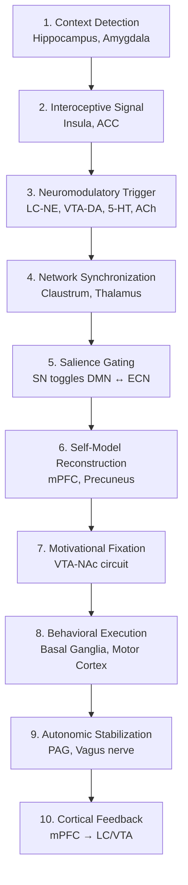

# 🧠 RPS Theory: Psychology of Inner Worlds

### Role-Based Psychological Systems | Ролевые Психологические Системы

[](https://creativecommons.org/licenses/by/4.0/)
[](https://github.com/pererodin/RPS-Theory)
[](CONTRIBUTING.md)

> **A neurocognitive framework for understanding personality as a dynamic system of role-based configurations, each with its own lifecycle, neural basis, and phenomenological signature.**

---

## 📖 What is RPS Theory?

**Role-Based Psychological Systems (RPS)** proposes that human personality is organized not as a single, stable entity, but as a **dynamic system of semi-autonomous role-based configurations**. Each RPS has:

🔹 **Unique neural architecture** (specific DMN-SN-ECN patterns)  
🔹 **Distinct autobiographical narrative** (different memories, values, goals)  
🔹 **Characteristic emotional tone** (affect varies by role)  
🔹 **Behavioral repertoire** (context-appropriate actions)  
🔹 **Complete lifecycle** (Birth → Flourishing → Stagnation → Death)

---

## 🎯 Core Concepts

### **Three-Level Architecture of Self**

```
Proto-Self     →  Vitality, pre-reflective aliveness (brainstem)
    ↓
Core-Self      →  Minimal "I am here, now" presence (insula, ACC, thalamus)
    ↓
RPS Systems    →  Autobiographical role configurations (cortical networks)
```

**Integration prevents fragmentation. Flexibility enables adaptation.**

---

### **Seven Fundamental Roles**

| # | Role | Activation Context | Lifecycle Phase |
|---|------|-------------------|-----------------|
| **1** | **Son/Daughter** | Family of origin | Birth → Lifelong |
| **2** | **Sibling** | Peer relations in family | Birth/Early childhood → Lifelong |
| **3** | **Student** | Learning environments | School age → Ongoing |
| **4** | **Specialist** | Professional context | Career entry → Retirement |
| **5** | **Partner** | Romantic/intimate dyad | Adolescence → Variable |
| **6** | **Spouse** | Committed partnership | Partnership commitment → Variable |
| **7** | **Parent** | Caregiving to offspring | Birth of child → Empty nest |

**Each role can be in any phase:** Birth (emerging), Flourishing (integrated), Stagnation (burnout), or Death (role loss).

---

### **🔥 Key Innovation: Role Reconfiguration Window (ORR)**

**Definition:** The measurable time interval (typically **1-5 minutes**) required for complete neurobiological and phenomenological transition between roles.

**Measured via:**
- Heart Rate Variability (HRV) recovery
- Pupil dilation-contraction cycle
- EEG network reconfiguration
- Behavioral onset latency

**Clinical Significance:**
- **Normal (1-5 min):** Healthy role flexibility
- **Prolonged (>7 min):** Role dissociation, burnout risk
- **Shortened (<1 min):** Hyper-adaptation, anxiety

**Why it matters:** ORR makes RPS theory **empirically testable** — personality dynamics become measurable.

---

## 🧬 Neurobiological Basis

### **10-Phase Neural Chain of Role Switching**



**Key Systems:**
- **LC-NE (Locus Coeruleus):** Triggers role switching via "reset" signal
- **Salience Network (SN):** Gates between internal (DMN) and external (ECN) focus
- **Default Mode Network (DMN):** Maintains autobiographical self-model for each role
- **VTA-DA (Dopamine):** Reinforces newly activated role configuration

📄 **Detailed documentation:** [`theory/neural-chain-switching.md`](theory/neural-chain-switching.md)

---

## 📂 Repository Structure

```
rps-theory/
│
├── theory/                           # Core theoretical documents
│   ├── rps-core-theory.md           # Comprehensive theory overview
│   ├── orr-window.md                # Role Reconfiguration Window (ORR)
│   └── neural-chain-switching.md    # 10-phase neurobiological model
│
├── papers/                          # Scientific literature reviews
│   ├── neural-mechanisms-comprehensive.md
│   └── lc-ne-system-evidence.md
│
├── instruments/                     # Assessment tools & protocols
│   └── orr-measurement-protocol.md  # How to measure ORR
│
├── clinical/                        # Clinical applications
│   └── applications.md              # Therapy protocols, case studies
│
├── research/                        # Empirical research
│   ├── testable-predictions.md     # Falsifiable hypotheses
│   ├── neural-chain-v1.md          # Model evolution (archived)
│   └── neural-chain-v2.md          # Model evolution (archived)
│
├── visuals/                         # Diagrams, figures, presentations
│
└── docs/                            # Documentation
    ├── glossary.md                  # Key terms and definitions
    ├── references.md                # Comprehensive bibliography
    └── contributing.md              # How to contribute
```

---

## 🚀 Quick Start

### **For Researchers**

1. **Read theory foundation:**
   - [`theory/rps-core-theory.md`](theory/rps-core-theory.md)
   - [`theory/orr-window.md`](theory/orr-window.md)

2. **Review testable predictions:**
   - [`research/testable-predictions.md`](research/testable-predictions.md)

3. **Explore neurobiological mechanisms:**
   - [`theory/neural-chain-switching.md`](theory/neural-chain-switching.md)
   - [`papers/neural-mechanisms-comprehensive.md`](papers/neural-mechanisms-comprehensive.md)

4. **Check bibliography:**
   - [`docs/references.md`](docs/references.md)

### **For Clinicians**

1. **Understand core concepts:**
   - [`theory/rps-core-theory.md`](theory/rps-core-theory.md) (sections 7-8)

2. **Review clinical applications:**
   - [`clinical/applications.md`](clinical/applications.md)

3. **Learn assessment methods:**
   - RPS Mapping Interview
   - ORR self-report

4. **Explore therapeutic protocols:**
   - Role Transition Therapy
   - Burnout Prevention
   - Identity Integration

### **For Students**

1. **Start with overview:**
   - This README
   - [`theory/rps-core-theory.md`](theory/rps-core-theory.md) (sections 1-5)

2. **Learn key terms:**
   - [`docs/glossary.md`](docs/glossary.md)

3. **Explore one aspect in depth:**
   - ORR for psychophysiology students
   - Lifecycle for developmental psych students
   - Neural chain for neuroscience students

4. **Consider research projects:**
   - See [`CONTRIBUTING.md`](CONTRIBUTING.md) → Student Projects section

---

## 🔬 Current Status

### **Theoretical Development**
✅ Core model articulated  
✅ Neurobiological mechanisms mapped  
✅ ORR metric defined  
✅ Clinical protocols drafted  

### **Empirical Validation**
🟡 RAMSD-7 questionnaire: **In development**  
🟡 ORR measurement: **Pilot protocols ready**  
🟡 Neuroimaging study: **Planning phase**  
🟡 Clinical trial: **Designed, awaiting funding**

### **Publications**
📝 Preprint: **In preparation** (est. Q1 2026)  
📝 Peer-reviewed article: **Planned** (2026)

---

## 💡 Why RPS Theory Matters

### **Explains Phenomena Other Theories Don't**

✨ **Empty Nest Syndrome:** Not "children leaving," but **death of "active Parent" RPS**  
✨ **Burnout:** Not "overwork," but **RPS stagnation without renewal**  
✨ **Retirement Depression:** Not "lack of activity," but **death of "Specialist" identity**  
✨ **Work-Life Conflict:** Not "time management," but **inter-RPS competition** for dominance

### **Provides Measurable Metrics**

- **ORR duration:** Individual differences in role flexibility
- **Lifecycle phase:** Predict burnout risk, intervention targets
- **Neural signatures:** Different roles = different brain patterns

### **Bridges Levels of Analysis**

```
Culture/Sociology → Social roles, expectations
         ↓
Psychology → RPS configurations, identity
         ↓
Neuroscience → Network dynamics, neuromodulation
         ↓
Physiology → HRV, pupil, autonomic state
```

---

## 📊 Key Predictions (Testable)

1. **ORR is measurable and stable** within individuals (ICC > 0.7)
2. **LC-NE causally triggers role switching** (pharmacological manipulation)
3. **Different roles show distinct DMN configurations** (fMRI connectivity)
4. **Role death produces grief response** (cortisol, DMN disruption)
5. **Stagnation predicts burnout 6 months later** (longitudinal design)
6. **Vagal training shortens ORR** (HRV biofeedback intervention)

📄 **Full list:** [`research/testable-predictions.md`](research/testable-predictions.md)

---

## 🤝 How to Contribute

We welcome contributions from:
- **Neuroscientists** (fMRI, EEG, psychophysiology)
- **Clinical psychologists** (case studies, therapy innovations)
- **Researchers** (empirical testing of predictions)
- **Theoreticians** (conceptual refinement, critique)
- **Developers** (assessment tools, data analysis scripts)
- **Translators** (making theory accessible globally)

📄 **See full guidelines:** [`CONTRIBUTING.md`](CONTRIBUTING.md)

**Quick ways to start:**
- 🐛 Report issues or suggest improvements
- 📝 Share clinical cases (anonymized)
- 🔬 Conduct pilot studies
- 📚 Improve documentation
- 🌍 Translate materials

---

## 📮 Contact

**Stanislav Pererodin**  
GitHub: [@pererodin](https://github.com/pererodin)  
Email: [to be added]

**For:**
- Research collaboration
- Clinical consultation
- Media inquiries
- General questions → [Open an Issue](https://github.com/pererodin/RPS-Theory/issues)

---

## 📜 Citation

If you use RPS theory in your work, please cite:

```bibtex
@misc{pererodin2025rps,
  author = {Pererodin, Stanislav},
  title = {Role-Based Psychological Systems: A Neurocognitive Framework 
           for Personality Organization},
  year = {2025},
  publisher = {GitHub},
  url = {https://github.com/pererodin/RPS-Theory},
  note = {Version 1.0}
}
```

---

## ⚖️ License

- **Theory & Documentation:** [CC BY 4.0](https://creativecommons.org/licenses/by/4.0/) (free use with attribution)
- **Assessment Instruments:** [CC BY-NC-SA 4.0](https://creativecommons.org/licenses/by-nc-sa/4.0/) (non-commercial use)
- **Code:** [MIT License](https://opensource.org/licenses/MIT)

📄 **Full license details:** [`LICENSE`](LICENSE)

---

## 🌟 Acknowledgments

RPS theory builds on foundational work by:
- Antonio Damasio (hierarchical self model)
- Vinod Menon (salience network framework)
- James Shine (neuromodulation and network dynamics)
- Sara Lazar (LC-NE system)
- Richard Schwartz (Internal Family Systems)
- And many others cited in [`docs/references.md`](docs/references.md)

---

## 🗺️ Roadmap

### **2025**
- ✅ Theory documentation complete
- 🟡 RAMSD-7 pilot validation (N=200)
- 🟡 ORR measurement protocol standardization
- 🟡 First preprint submission

### **2026**
- Neuroimaging study (role switching fMRI)
- LC-NE pharmacological test
- Clinical RCT (RPS therapy vs. CBT for burnout)
- Peer-reviewed publication

### **2027+**
- Cross-cultural validation
- Longitudinal study (5-year follow-up)
- Clinical training program
- Computational modeling

---

## ⭐ Star History

If you find this project valuable, please consider:
- ⭐ **Starring** the repository
- 👀 **Watching** for updates
- 🔄 **Sharing** with colleagues
- 🤝 **Contributing** (see [CONTRIBUTING.md](CONTRIBUTING.md))

---

## 📚 Further Reading

- **Theoretical foundation:** [`theory/rps-core-theory.md`](theory/rps-core-theory.md)
- **ORR metric:** [`theory/orr-window.md`](theory/orr-window.md)
- **Neurobiology:** [`theory/neural-chain-switching.md`](theory/neural-chain-switching.md)
- **Clinical use:** [`clinical/applications.md`](clinical/applications.md)
- **Research:** [`research/testable-predictions.md`](research/testable-predictions.md)
- **Glossary:** [`docs/glossary.md`](docs/glossary.md)
- **References:** [`docs/references.md`](docs/references.md)

---

<div align="center">

**RPS Theory: Understanding the multiplicity within unity**

*Developed by [Stanislav Pererodin](https://github.com/pererodin)*

[](https://github.com/pererodin)
[](https://creativecommons.org/licenses/by/4.0/)

**Version 1.0 | October 2025**

</div>
